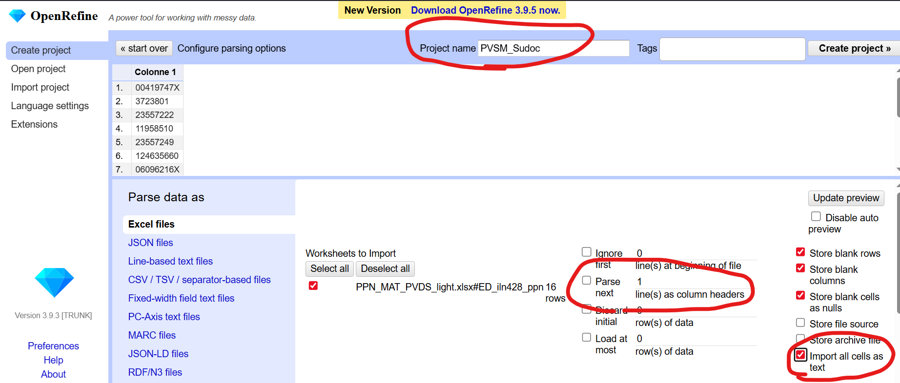
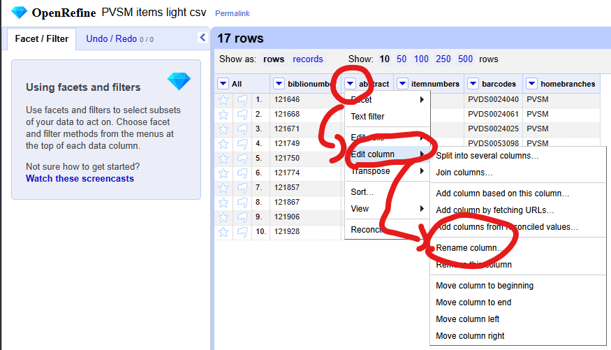
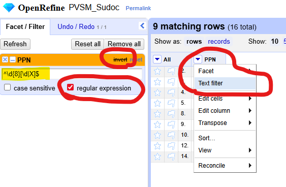
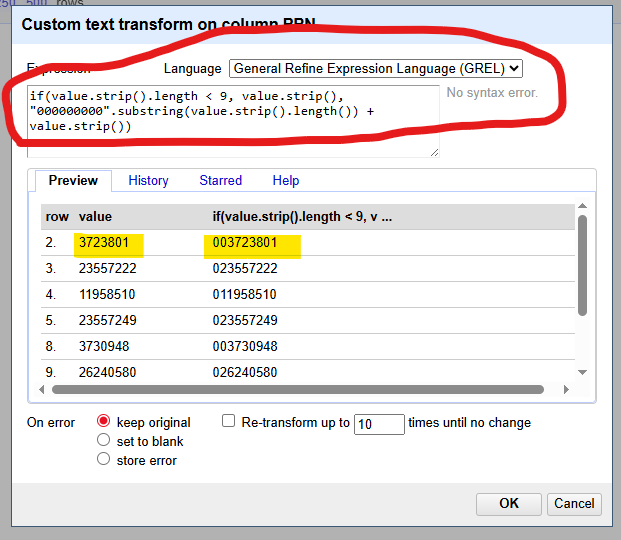
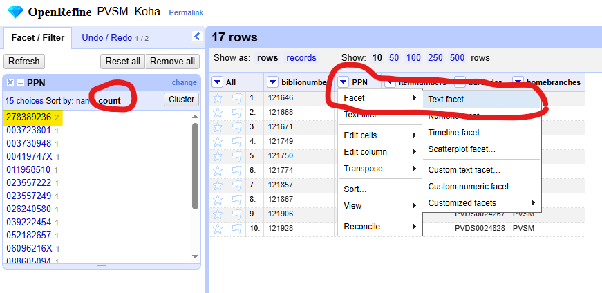
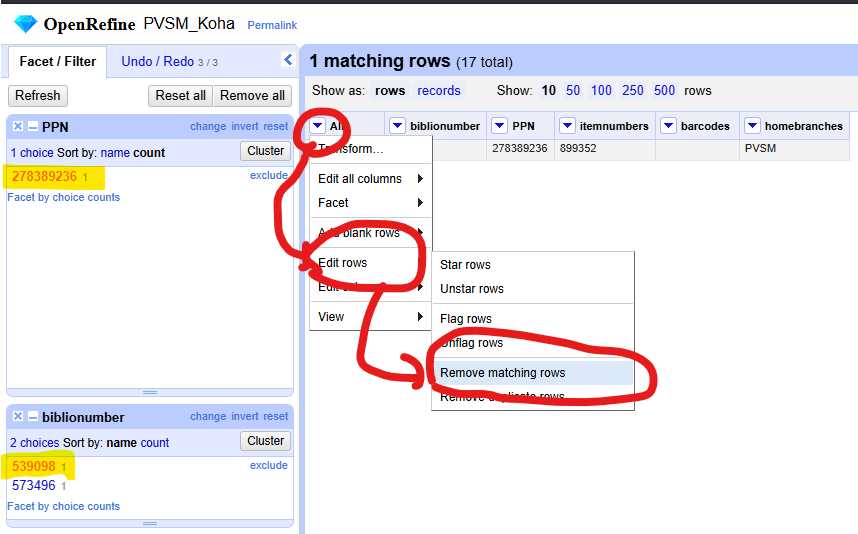
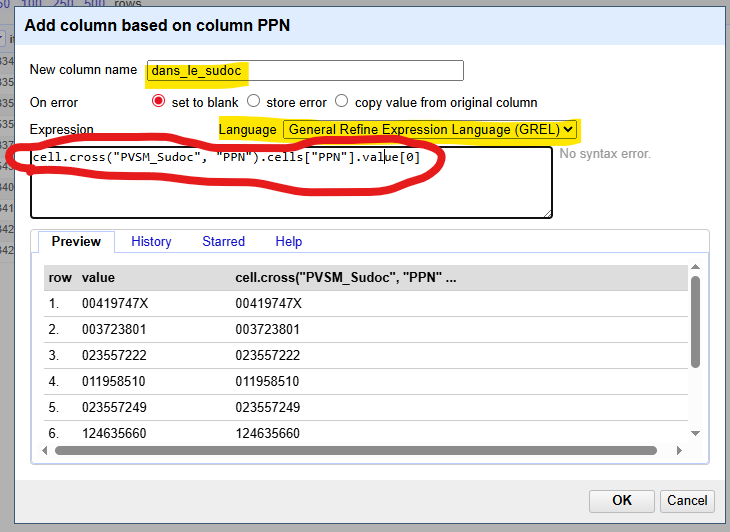
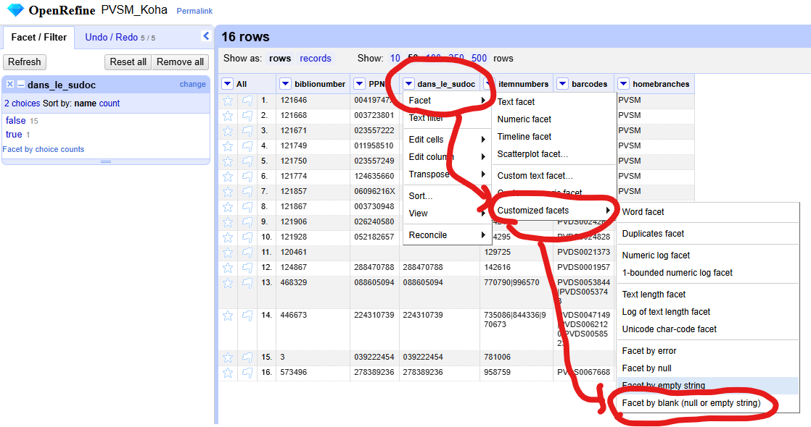
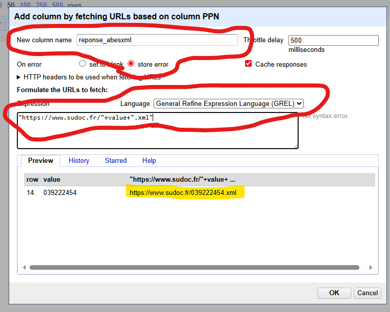
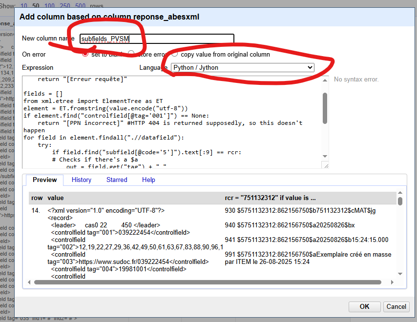

# Cas pratique 1 [Écoles d'achitecture et de paysage] : comparer les les exemplarisation d'une bibliothèque dans Koha & dans le Sudoc

La matériauthèque de l'école de Paris-Val de Seine a récemment été exemplarisée en masse dans le Sudoc suite à sa séparation de la bibliothèque de l'école.

Objectif principal : vérifier que toutes les notices Koha avec un exemplaire de la matériauthèque sont correctement localisées dans le Sudoc pour cette bibliothèque **et uniquement celles-ci**

Il faudra donc comparer les deux listes et identifier si certaines notices ne sont présentes que dans Koha ou que dans le Sudoc

> 💡 Préparez un fichier de suivi à côté pour noter diverses anomalies qui apparaitraient au cours de l'analyse

## Fichiers sources

Dans ce cas pratique, les fichiers sources ne vont contenir aucune information autre que des identifiants.

Mapping des identifiants :

| Libellé | Code de l'école dans Koha | RCR |
| --- | --- | --- |
| Matériauthèque | `PVSM` | `751132312` |
| Bibliothèque | `PVDS` | `751132309` |

### Sudoc

Pour les données du Sudoc, le fichier source [`PPN_MAT_PVDS_light.xlsx`](./PPN_MAT_PVDS_light.xlsx) contient uniquement une liste de PPN dans un fichier au format XLSX, sans en-têtes, provenant de l'Abes.

### Koha

Pour les données de Koha, dans l'idéal, le fichier source est à récupérer juste avant de commencer le travail de comparaison.
Ici, le fichier [`PVSM_items_light.csv`](./PVSM_items_light.csv) est un fichier au format CSV contenant les colonnes suivantes :

* `biblionumber` : numéro interne de la notice de Koha 
* `b.abstract` : PPN lié à la notice Koha
* `itemnumbers` : numéro interne des exemplaires, séparés par `|`
* `barcodes` : code-barres des exemplaires, séparés par `|`
* `homebranches` : code de l'école propriétaire des exemplaires, séparés par `|`

``` SQL
-- Requête pour obtenir ces données :
SELECT b.biblionumber as biblionumber,
    b.abstract,
    GROUP_CONCAT(i.itemnumber SEPARATOR '|') AS itemnumbers,
    GROUP_CONCAT(i.barcode SEPARATOR '|') AS barcodes,
    GROUP_CONCAT(i.homebranch SEPARATOR '|') as homebranches
FROM items i
LEFT JOIN biblio b USING(biblionumber)
WHERE (i.homebranch = "PVSM")
	OR (i.homebranch = "PVDS" AND i.location = "MAT")
GROUP BY biblionumber
```

## 1. Import des fichiers 

### 1.1 Créez un premier projet

Importez le fichier [`PPN_MAT_PVDS_light.xlsx`](./PPN_MAT_PVDS_light.xlsx) contenant les données du Sudoc.

Sur la page qui s'affiche :

* Nommez le projet *PVSM_Sudoc* (en haut à droite)
* Décochez _Parse next 1 line as column headers_ (en bas au milieu)
* Cochez _Importer toutes les cellules en tant que texte_ (en bas à droite)



### 1.2 Créez un second projet

Importez le fichier [`PVSM_items_light.csv`](./PVSM_items_light.csv) contenant les données de Koha. Nommez le projet *PVSM_Koha*.

> 💡 **ASTUCE :** Pour ouvrir un deuxième projet à partir d'un projet en cour d'édition cliquez sur le bouton ``Ouvrir...`` en haut à droite de l'espace de travail.

## 2. Préparer la clef de concordance

Nous savons que nos fichiers sources contiennent tous les deux une liste de PPN : nous utilisrerons donc cette colonne en tant que clef de concordance.

### 2.1 Renommer les colonnes pour plus de facilités

Pour faciliter les opérations, renommez la colonne contenant le PPN en _PPN_ dans les deux projets :

* Pour renommer une colonne, cliquez sur la flèche juste à côté de son nom, puis _Modifier la colonne_ puis _Renommer la colone_
* Projet *PVSM_Sudoc* : renommer _Colonne 1_ en _PPN_
* Projet *PVSM_Koha* : renommer _abstract_ en _PPN_



### 2.2 Corriger la forme des PPN provenant du Sudoc

Dnas le projet *PVSM_Sudoc*, on remarque que certains PPN ont été transformés en chiffre à un moment donné, supprimant les zéro en tête de PPN.

On peut vérifier le nombre de PPN avec une forme incorrecte avec l'option de _Filtre textuel_.
Cette option permet de filtrer les lignes qui contiennent la chaîne de texte recherchée dans la colonne filtrée.
Il est également possible de filtrer en utilisant une expression régulière pour des détections plus précises.

* Cliquez sur la flèche juste à côté du nom de la colonne, puis _Filtre textuel_
* Dans le menu à gauche, cochez _Expression régulière_
* Coller l'expression régulière suivante : `^\d{8}[\d|X]$`
* Cliquez sur le bouton _Invert_ pour afficher toutes les lignes qui ne correspondent pas à cette expression régulière



> 💡 **ASTUCE :** lorsque vous inversez une facette ou filtre textuelle, le haut de sa fenêtre s'affiche en orange (contre bleu normalement)

On constate que certaines lignes doivent être corrigées :

* Cliquez sur la flèche juste à côté du nom de la colonne, puis _Modifier cellules..._ puis _Transformer..._
* Vérifiez que le langage sélectionné est bien _General Refine Expression Language (GREL)_
* Collez l'expression suivante : `if(value.strip().length < 9, value.strip(), "000000000".substring(value.strip().length()) + value.strip())`
  * Note sur la transformation utilisée : retire tous les espaces avant et après le PPN puis, si le PPN fait moins de 9 caractères, ajoute autant de `0` que nécessaire
* Observez dans la prévisualisation en bas que le résultat de l'opération est correct
* Validez avec _OK_
* Observez que plus aucune ligne ne s'affichent (parce que tous les PPN ont désormais une forme correcte)
* Cliquez sur _Remove all_ en haut dans le menu de droite pour supprimer toutes les facettes & filtres actuellement définis



> 💡 Le bouton _Remove all_ supprime toutes les facettes et filtres définis, vous pouvez utilisez _Reset all_ si vous voulez les remettre à zéro sans les supprimer.

### 2.3 Vérifier qu'il n'y a pas de doublons de PPN

Pour le projet *PVSM_Sudoc*, nous savons que les PPN sont un identifiant unique, donc en théorie, les PPN ne sont pas dupliqués.

En revanche, pour le projet *PVSM_Koha*, l'identifiant unique d'une notice est son _biblionumber_, plusieurs notices pourraient contenir le même PPN.

Une manière relativement facile de vérifier la présence de doublons sans supprimer de lignes est d'utiliser les **facettes textuelles** :

* Cliquez sur la flèche juste à côté du nom de la colonne, puis _Facette_ puis _Facette textuelle_
* Dans le menu à gauche, une liste apparaît
* Cliquez sur _compte_ dans les options de tri
* Observez comment le PPN `278389236` renvoie deux résultats
* En cliquant dessus, vous pouvez n'afficher que les lignes contenant ce PPN



Dans votre fichier de suivi, notez qu'il faudra probablement fusionner les notices `539098` & `573496` qui semblent être un doublon, toutes deux liées au PPN `278389236`.

Pour le moment, on constate que la notice `539098` n'a pas de code-barre rattaché à la matériauthèque, donc :

* Ouvrez une facette textuelle sur la colonne _biblionumber_
* Filtrez uniquement le biblionumber `539098`
* Cliquez sur la flèche juste à côté de _Tous_ puis _Modifier lignes..._ puis _Remove mathcing rows_
* → Cela supprimera la ligne
* Dans le menu à gauche, cliquez sur _Reset all_ pour retirer tous les filtres actifs
* Observez qu'il ne reste plus aucun PPN en double



> 💡 **ASTUCE :** En cliquant sur la flèche juste à côté de _Tous_ puis _Modifier lignes..._ puis _Remove duplicate rows_, vous pouvez supprimez les doublons, cependant, si vous n'avaez pas dans un premier temps noté les anomalie,s vous ne saurez pas ce qui les a causé.

## 3. Croiser les deux fichiers - importer les données du Sudoc dans la liste des donneés de Koha

Maintenant que les clefs de concordances sont prêtes dans les deux projets, nous pouvons récupérer les informations d'un projet dans l'autre pour commencer l'analyse.

À partir du projet *PVSM_Koha* :

* Assurez-vous qu'aucun filtre ou facette n'est actif
* Cliquez sur la flèche juste à côté de la colonne *PPN*, choisir _Editer la colonne_ puis _Ajouter une colonne en fonction de cette colonne_.
* Dans la fenêtre de saisie qui s'ouvre :
  * Nommer la colonne *dans_le_sudoc*
  * Vérifier que le langage est GREL
  * Collez l'expression suivante : `cell.cross("PVSM_Sudoc", "PPN").cells["PPN"].value[0]`
  * Validez



> 💡 **ASTUCE :** Si vous répétez l'opération en utilisant l'expression `cell.cross("PROJET", "ID").cells["column"].value[0]`, validez, puis essayez de refaire l'opération à nouveau, vous pouvez cliquez sur _Historique_ puis sur l'étoile à côté de l'expression. Désormais, si vous cliquez sur _Starred_, vous trouverez cette expression générique : il vous suffira de cliquer sur _Reuse_ pour l'importer et vous pourrez la modifier en fonction de vos besoins.

Détaillons comment fonctionne cette formule puisqu'elle est extrêmement pratique :

1. Vous devez l'utiliser dans le projet qui va **recevoir** les données
2. Vous devez sélectionnez la colonne qui contient **la clef de concordance**
3. Au sein de l'expression, `"PROJET"` (`"PVSM_Sudoc"` dans l'exemple au-dessus) correspond **au nom du projet dans lequel vous allez récupérer les données**
4. Au sein de l'expression, `"ID"` (1er `"PPN"` dans l'exemple au-dessus) correspond **au nom de la colonne contenant la clef de concordance dans le projet dans lequel vous allez récupérer les données**
5. Au sein de l'expression, `"column"` (2e `"PPN"` dans l'exemple au-dessus) correspond **au nom de la colonne que vous voulez importer du projet dans lequel vous allez récupérer les données**

Note : il faut **toujours** écrire le nom du projet et des colonnes entre guillemets

## 4. Analyse des notices Koha exempalrisées dans le Sudoc

### 4.1 Repérer les notices absentes du Sudoc

Pour repérer des notices qui ne sont pas exemplarisées dans le Sudoc, il suffit maintenant de regarder si certaines lignes n'ont pas de données dans la colonne *dans_le_sudoc*.

Il suffit alors d'utiliser la facette par blanc :

* Cliquez sur la flèche juste à côté du nom de la colonne, puis _Facette_ puis _Facette personnalisée_ puis _Facette par blanc (null oiu texte vide)_
* Dans le menu à gauche, une liste apparaît : _false_ permet d'afficher toutes les lignes qui ont une valeur pour cette colonne, _true_ toutes celles qui n'en n'ont pas



Désormais, vous pouvez ressortir votre fichier de suivi et prendre des notes.
N'hésitez pas à combiner les filtres pour groupre les anomalies par cas précis.

Par exemple, si vous rajoutez une facette par blanc sur la colonne _PPN_, vous pouvez identifier 2 cas différents :

* Les notices Koha sans PPN qui ne sont pas exemplarisées dans le Sudoc
* Les notices Koha avec un PPN qui ne sont pas exemplarisées dans le Sudoc

### 4.2 Exporter les données

Il est parfois plus facile d'exporter une liste que de reporter anuellement tous les cas dans un fichier de suivi.

**Si vous avez des facettes et filtres actifs, par défaut, les exports ne contiendront que les lignes que vous affichez actuellement**

Pour ce faire, cliquez sur export en haut à droite, puis sélectionnez une des options.

Optionnellement, vous pouvez choisir _Custom tabular_, qui vous donnera plus d'options d'export tel que :

* Exporter seulement certaines colonnes
* Ne pas exporter les en-têtes
* Choisir le format du fichier

## 5. Croiser les fichiers & analyser les données présentes dans le Sudoc

### 5.1 Importer les données de Koha

À partir du projet *PVSM_Sudoc* :

* Assurez-vous qu'aucun filtre ou facette n'est actif
* Ajouter des colonnes basé sur le _PPN_ pour importer :
  * Le biblionumber : expression GREL `cell.cross("PVSM_Koha", "PPN").cells["biblionumber"].value[0]`
  * Les code-barres : expression GREL `cell.cross("PVSM_Koha", "PPN").cells["barcodes"].value[0]`
  * Les bibliothèque propriétaires : expression GREL `cell.cross("PVSM_Koha", "PPN").cells["homebranches"].value[0]`

Réordonnons les colonnes pour qu'elles s'éaffichent dans un ordre plus logique :

* Cliquez sur la flèche juste à côté de _Tous_ puis _Modifier colonnes..._ puis _Réordonner / supprimer colonnes_
* Réordonner les colonnes pour afficher :
    1. _PPN_
    2. _biblionumber_
    3. _homebranches_
    4. _barcodes_

> 💡 **ASTUCE :** Si vous déplacez des noms de colonne dans la zone de droite, elles seront supprimées : très pratique si vous avez créé plsuieurs colonnes intermédiaires dont vous n'avez plus l'utilité

### 5.2 Répérer les notices exemplarisées dans le Sudoc absentes de Koha

Utilisez une facette par blanc sur les _biblionumbers_ pour répérer les PPN qui n'ont renvoyés aucune notice Koha.

**Attention à l'interprétation des données :** rappelez-vous de ce que contient les données ud fichier source de Koha :

* Si vous avez interprété qu'il n'y a dans Koha aucune notice avec ces PPN, c'est inexact
* Le fichier source ne contenait que les notices possédants des exemplaires de Paris-Val de Seine, soit à la matériauthèque, soit dans la localisation matériautthèque de la bibliothèque
* L'interprétation correcte est donc que pour la liste de PPN trouvée, aucune notice dans Koha ne possèdant un exemplaire de la matériauthèque n'a ce PPN
* Ce qui **peut** vouloir dire qu'aucune notice dans Koha n'a ce PPN
* Mais qui peut aussi vouloir dire que l'exemplaire en question n'est pas rattaché à la notice Koha qui possède ce PPN

Vous pouvez maintenant compléter le fichier de suivi et exporter des données si nécessaire.

## 6. Analyser au-delà de l'objectif initial

Nous avons désormais accompli l'objectif principal, cependant, tout au long de la procédure, vous avez peut-être remarqué des anomalies en dehors de notre objectif principal.

Nous avons déjà trouver un PPN présent sur plusieurs notices, mais il est possible d'utiliser les données à notre disposition pour effectuer quelques vérifications bonus.

### 6.1 Des exemplaires sans code-barres mais exemplarisés dans le Sudoc ?

Si vous connaissez le fonctionnement de la passerelle Sudoc d'ArchiRès, vous savez qu'un exemplaire dans le Sudoc doit forcément avoir un code-barre pour redescendre du Sudoc vers Koha.

Essayez de voir s'il existe des cas de documents exemplarisés pour la matériauthèque dans le Sudoc, correctement présent dans Koha mais sans code-barre dans Koha :

* Allez dans le projet *PVSM_Sudoc*
* Affichez les lignes qui possèdent un biblionumber mais pas de code-barres (utilisez les facettes par blanc)

### 6.2 [Avancé] Interroger les webservices l'Abes pour récupérer des données

OpenRefine permet d'interroger des webservices, ce qui peut être très pratique, à condition de savoir manipuler les résultats renvoyés.

Cette partie a plus valeur de démonstration de ce que l'application permet de faire.

Lorsque vous essayez de récupérer des données via webservices, **pensez à correctement filtrer vos données** : si vous n'avez pas besoin qu'une ligne interroge le webservice, vous perdrez du temps (si chaque ligne prend 500ms, 1000 lignes inutiles vous feront perdre plus de 8 minutes) & vous ne dérangez pas le serveur cible avec des requêtes inutiles.

Essayons de récupérer les ifnormations d'exemplaires de la matériauthèque associé aux PPN sans code-barre dans Koha :

* Vérifiez que vous filrtez correctement vos données
* Cliquez sur la flèche juste à côté de _PPN_, puis _Edit column..._ puis _Add column by fetching URL..._
* Dans la fenêtre qui s'ouvre :
  * Nommez la colonne *reponse_abesxml*
  * Sélectionnez _Store error_
  * Utiliser l'expression GREL : `"https://www.sudoc.fr/"+value+".xml"`
  * Note : la prévisualisation vous montre l'URL que vous vous apprêtez à interroger



Vous avez désormais récupérer les données de l'Abes en XML, il faut désormais les manipuler : ajouter une nouvelle colonne basé sur *reponse_abesxml* :

* Nommer la colonne *subfields_PVSM*
* Sélectionner le langage *Python / Jython*
* Coller l'expression suivante :
  * Note : elle permet de lister tous les champs de la notice qui sont liés au RCR de la matériauthèque ed Paris-Val de Seine

``` Python
rcr = "751132312"

if value is None:
    return "[Erreur requête]"

fields = []
from xml.etree import ElementTree as ET
element = ET.fromstring(value.encode("utf-8"))
if element.find("controlfield[@tag='001']") == None:
    return "[PPN incorrect]" #HTTP 404 is returned supposedly, so this doesn't happen
for field in element.findall(".//datafield"):
    try:    
        if field.find("subfield[@code='5']").text[:9] == rcr:
        # Checks if there's a $a
            out = field.get("tag") + " "
            for subf in field.findall(".//subfield"):
                try:
                    out += "$" + subf.get("code") + subf.text
                except:
                    out += "[PB sur subf]"
            fields.append(out)
    except:
        continue
if len(fields) == 0:
    fields.append("[Pas de champs pour ce RCR]")
return "\n\n".join(fields)
```



Si vous n'avez plus besoin de *reponse_xml*, supprimez la colonne pour faicliter la lecture.

Vous pouvez désormais regarder les informations de chaque champs et répérer s'il y a un problème : par exemple, dans ce cas, est-ce que les exemplaires ont un `915$b`.

### 6.3 Des exemplaire sencore localisé à la bibliothèque dans la localisation _Matériauthèque_

En théorie, la bibliothèque ne doit plus avoir d'exemplaires dans sa localisation _Matériauthèque_.

Il suffit ici simplement de filtrer textuellement le projet *PVSM_Koha* sur les _homebranches_ avec la valeur `PVDS` & tous les exemplaires encore rattachés à la bibliothèque apparaîtront.

Selon la quantité de résultats et ce que vous arrivez à faire, il sera ensuite possible de refaire une extraction de Koha pour isoler ces cas, potentiellement rajouter des informations extraites, potentiellement faire appels au webservice de l'Abes pour récupérer les données présentes dans le Sudoc, etc.