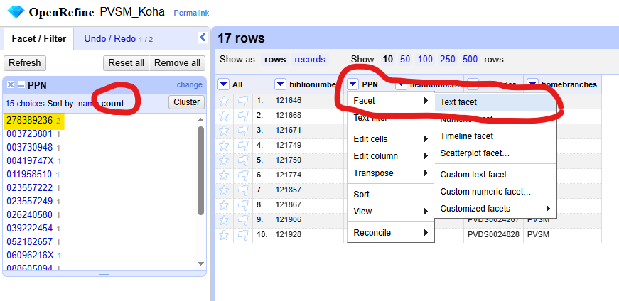

# Cas pratique 1 [Écoles d'achitecture et de paysage] : comparer les les exemplarisation d'une bibliothèque dans Koha & dans le Sudoc

La matériauthèque de l'école de Paris-Val de Seine a récemment été exemplarisée en masse dans le Sudoc suite à sa séparation de la bibliothèque de l'école.

Objectifs :

* Vérifier que toutes les notices Koha avec un exemplaire de la matériauthèque sont correctement localisées dans le Sudoc pour cette bibliothèque **et uniquement celles-ci**
* Vérifier que certains exemplaires de la matériauthèque ne sont pas rattachés à la bibliothèque dans Koha ou le Sudoc

Il faudra donc comparer les deux listes et identifier si certaines notices ne sont présentes que dans Koha ou que dans le Sudoc

> 💡 Préparez un fichier de suivi à côté pour noter diverses anomalies qui apparaitraient au cours de l'analyse

## Fichiers sources

Dans ce cas pratique, les fichiers sources ne vont contenir aucune information autre que des identifiants.

Mapping des identifiants :

| Libellé | Code de l'école dans Koha | RCR |
| --- | --- | --- |
| Matériauthèque | `PVSM` | `751132312` |
| Bibliothèque | `PVDS` | `751132309` |

### Sudoc

Pour les données du Sudoc, le fichier source [`PPN_MAT_PVDS_light.xlsx`](./PPN_MAT_PVDS_light.xlsx) contient uniquement une liste de PPN dans un fichier au format XLSX, sans en-têtes, provenant de l'Abes.

### Koha

Pour les données de Koha, dans l'idéal, le fichier source est à récupérer juste avant de commencer le travail de comparaison.
Ici, le fichier [`PVSM_items_light.csv`](./PVSM_items_light.csv) est un fichier au format CSV contenant les colonnes suivantes :

* `biblionumber` : numéro interne de la notice de Koha 
* `b.abstract` : PPN lié à la notice Koha
* `itemnumbers` : numéro interne des exemplaires, séparés par `|`
* `barcodes` : code-barres des exemplaires, séparés par `|`
* `homebranches` : code de l'école propriétaire des exemplaires, séparés par `|`

``` SQL
-- Requête pour obtenir ces données :
SELECT b.biblionumber as biblionumber,
    b.abstract,
    GROUP_CONCAT(i.itemnumber SEPARATOR '|') AS itemnumbers,
    GROUP_CONCAT(i.barcode SEPARATOR '|') AS barcodes,
    GROUP_CONCAT(i.homebranch SEPARATOR '|') as homebranches
FROM items i
LEFT JOIN biblio b USING(biblionumber)
WHERE (i.homebranch = "PVSM")
	OR (i.homebranch = "PVDS" AND i.location = "MAT")
GROUP BY biblionumber
```

## 1. Import des fichiers 

### 1.1 Créez un premier projet

Importez le fichier [`PPN_MAT_PVDS_light.xlsx`](./PPN_MAT_PVDS_light.xlsx) contenant les données du Sudoc.

Sur la page qui s'affiche :

* Nommez le projet *PVSM_Sudoc* (en haut à droite)
* Décochez _Parse next 1 line as column headers_ (en bas au milieu)


### 1.2 Créez un second projet

Importez le fichier [`PVSM_items_light.csv`](./PVSM_items_light.csv) contenant les données de Koha. Nommez le projet *PVSM_Koha*.

> 💡 **ASTUCE :** Pour ouvrir un deuxième projet à partir d'un projet en cour d'édition cliquez sur le bouton ``Ouvrir...`` en haut à droite de l'espace de travail.

## 2. Préparer la clef de concordance

Nous savons que nos fichiers sources contiennent tous les deux une liste de PPN : nous utilisrerons donc cette colonne en tant que clef de concordance.

## 2.1 Renommer les colonnes pour plus de facilités

Pour faciliter les opérations, renommez la colonne contenant le PPN en _PPN_ dans les deux projets :

* Pour renommer une colonne, cliquez sur la flèche juste à côté de son nom, puis _Modifier la colonne_ puis _Renommer la colone_
* Projet *PVSM_Sudoc* : renommer _Colonne 1_ en _PPN_
* Projet *PVSM_Koha* : renommer _abstract_ en _PPN_


## 2.2 Vérifier qu'il n'y a pas de doublons de PPN

Pour le projet *PVSM_Sudoc*, nous savons que les PPN sont un identifiant unique, donc en théorie, les PPN ne sont pas dupliqués.

En revanche, pour le projet *PVSM_Koha*, l'identifiant unique d'une notice est son _biblionumber_, plusieurs notices pourraient contenir le même PPN.

Une manière relativement facile de vérifier la présence de doublons sans supprimer de lignes est d'utiliser les **facettes textuelles** :

* Cliquez sur la flèche juste à côté du nom de la colonne, puis _Facette_ puis _Facette textuelle_
* Dans le menu à gauche, une liste apparaît
* Cliquez sur _compte_ dans les options de tri
* Observez comment le PPN `278389236` renvoie deux résultats
* En cliquant dessus, vous pouvez n'afficher que les lignes contenant ce PPN



Dans votre fichier de suivi, notez qu'il faudra probablement fusionner les notices `539098` & `573496` qui semblent être un doublon, toutes deux liées au PPN `278389236`.

Pour le moment, on constate que la notice `539098` n'a pas de code-barre rattaché à la matériauthèque, donc :

* Ouvrez une facette textuelle sur la colonne _biblionumber_
* Filtrez uniquement le biblionumber `539098`
* Cliquez sur la flèche juste à côté de _Tous_ puis _Modifier lignes..._ puis _Remove mathcing rows_
* → Cela supprimera la ligne
* Dans le menu à gauche, cliquez sur _Reset all_ pour retirer tous les filtres actifs
* Observez qu'il ne reste plus aucun PPN en double

> 💡 **ASTUCE :** En cliquant sur la flèche juste à côté de _Tous_ puis _Modifier lignes..._ puis _Remove duplicate rows_, vous pouvez supprimez les doublons, cependant, si vous n'avaez pas dans un premier temps noté les anomalie,s vous ne saurez pas ce qui les a causé.
