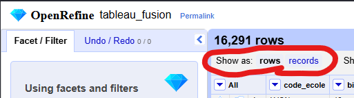
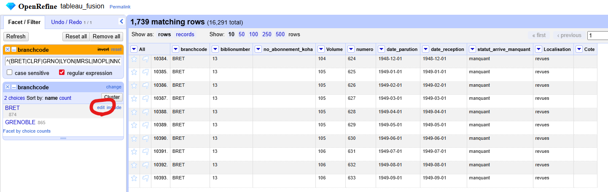
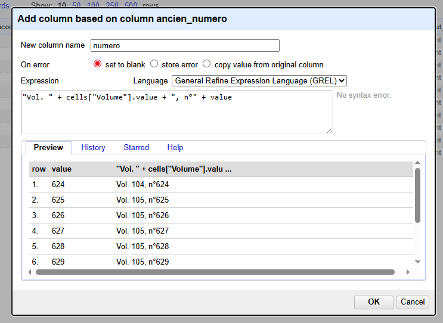
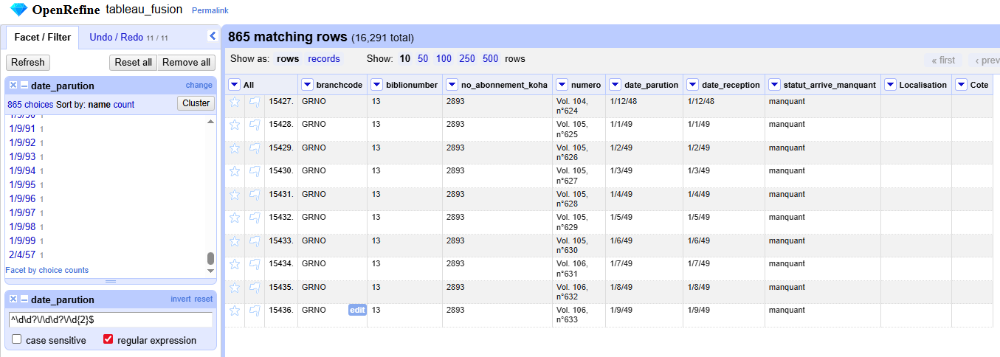
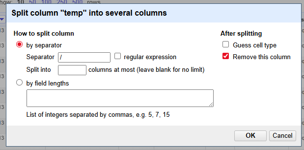
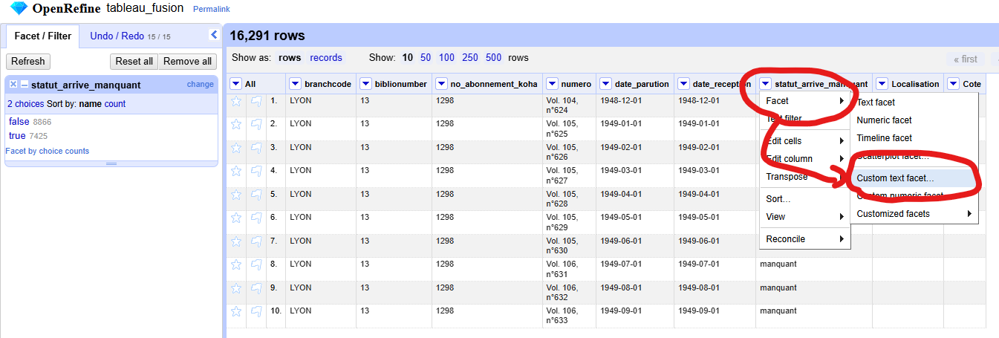
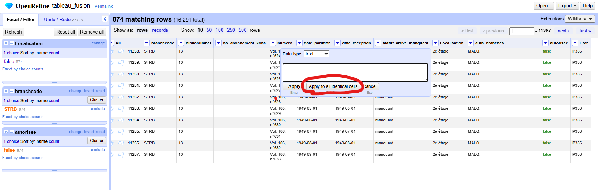

# Cas pratique 2 [Écoles d'achitecture et de paysage] : vérifier les données d'un tableau de bulletinnage restrospectif

Lors du bulletinnage rétrospectif, un tableau de données est transmis à notre prestataire pour une intégration dans Koha, qui contient tous les fascicules à ajouter.

Objectif : vérifier que le tableau est correct pour ne pas générer d'erreurs ou éviter que le fichier soit refusé par le prestataire.

### to do

1 colonne avec des écoles manquantes mais on a le numéro d'abonnnement à côté
vérifier que les biblionumber sont bien tous sans espaces
vérifier que les no abonnement sont bien tous sans espaces
vérifier que les code sistes sont légaux
fusionner volume & numéro
Verif format de dates + les corriger
* Unifier le statut

## Format attendu

Le fichier doit être un fichier CSV séparé par des `;`, encadrant les données entre guillemets, avec les colonnes suivantes :

* `branchcode` : doit contenir le code Koha de la bibliothèque
* `biblionumber` : doit contenir le biblionumber de la notice concernée par ce bulletinage rétrospectif
* `no_abonnement_koha` : doit contenir le numéro de l'abonnement contenant le fascicule. Peut être vide. Un même école peut avoir plusieurs abonnements, voir une période sans abonnement
* `numero` : doit contenir la forme finale du numéro à afficher. Dans le cadre de cet exemple : `Vol. X, n°Y` où X est un numéro de volume et Y un numéro de numéro
* `date_parution` : date de parution au format `YYYY-MM-DD`
* `date_reception` : date de réception du fascicule au format `YYYY-MM-DD`
* `statut_arrive_manquant` : si le fascicule est arrivé ou non. N'accepte que les valeurs `arrive` & `manquant`
* `Localisation` : libellé de la localisation dans Koha. Peut être vide
* `Cote` : cote dans Koha. Peut être vide

## Fichiers sources

* Le fichier [`bulletinage_retrospectif_fake.xlsx`](./bulletinage_retrospectif_fake.xlsx) contient le fichier à contrôler
* Le fichier [`auth_locs.csv`](./auth_locs.csv) contient la liste des localisations autorisées pour chaque bibliothèque, avec les colonnes suivantes :
  * `id` : identifiant de la localisation
  * `authorised_value` : code de la localisation
  * `lib` : libellé de la localisation
  * `auth_branches` : liste de codes de bibliothèques autorisées à utiliser cette localisation, séparés par `|`

``` SQL
-- Requête pour obtenir ces données :
SELECT av.id, av.authorised_value, av.lib, avb.auth_branches
FROM authorised_values av 
LEFT JOIN (
	SELECT av_id, GROUP_CONCAT(branchcode SEPARATOR '|') as auth_branches
	FROM authorised_values_branches
    GROUP BY av_id
    ) avb ON avb.av_id = av.id 
WHERE av.category = "LOC"
```

## 1. Import des fichiers 

Importez les deux fichiers :

* Le fichier à contrôler doit être nommé *tableau_fusion* et **doit importer toutes les cellules en tant que texte**
* Le fichier avec les localisations doit être nommé *loc_koha*

## 2. Analyse & corrections des données

Ouvrez le projet *tableau_fusion* et  **assurez-vous que le projet affiche des lignes** (si nécessaires, cliquez sur _rows_)



## 2.1 Informations sur la bibliothèque

Pour rappel, voici ce qui est attendu ici :

> `branchcode` : doit contenir le code Koha de la bibliothèque

* Le nom de la colonne est incorrect, renommez-la en *branchcode*
* Pour vérifier si les données sont correctes, appliquez un filtre textuel inversé avec l'expression régulière : `^(BRET|CLRF|GRNO|LYON|MRSL|MOPL|NNCY|NANT|NRMD|PBLV|MLVL|PLVT|MALQ|PVDS|PVSM|STET|STRB|TOUL|VRSL|BRDX|LILL)$`, qui vérifie si les données sont uniquement des codes Koha, sans espaces
* Observez qu'il y a des erreurs
* Pour analyser le problème, ouvrez une facette textuelle sur cette colonne
* Il est possible de modifier le contenu de toutes les lignes actuellement filtrer à partir d'une facette :
  * Cliquez sur le bouton _Edit_ à côté de la valeur de la facette
  * Une petite fenêtre s'ouvre avec la valeur
  * Corrigez la valeur
  * Appliquez
* Corrigez les deux erreurs sur le code (`BRET` a un retour à la ligne & des espaces, `GRENOBLE` devrait être `GRNO`)



Reste maintenant le problème de 118 lignes vides.
Nous pourrions nous retruver dans une situation où il nous serait impossible de corriger cette erreur.

Cependant, on observe que certaines de ces lignes ont un *no_abonement_koha* :

* Ajoutez une facette textuelle sur *no_abonement_koha*
* Cliquez sur la seule valeur qui s'affiche
* Supprimez le filtre textuel sur *branchcode*, mais conservez les 2 autres facette textuelle
* Observez comment la facette textuelle sur *branchcode* affiche désormais 2 valeurs
* Puisque une seule école peut être rattachée à un seul abonnement, vous pouvez assumer que les ligne ssans *branchcode* devrait avoir la même valeur que l'autre option
* Corrigez la valeur

Effectuez une dernière vérification :

* Remettez à zéro tous les filtres
* Créez de nouveau le filtre textuel inversé avec l'expression régulière : `^(BRET|CLRF|GRNO|LYON|MRSL|MOPL|NNCY|NANT|NRMD|PBLV|MLVL|PLVT|MALQ|PVDS|PVSM|STET|STRB|TOUL|VRSL|BRDX|LILL)$`, qui vérifie si les données sont uniquement des codes Koha, sans espaces
* Aucune ligne ne ressort : les données de cette colonne sont correctes
* Supprimez tous les filtres & facettes

## 2.2 Informations sur la notice

Pour rappel, voici ce qui est attendu ici :

> `biblionumber` : doit contenir le biblionumber de la notice concernée par ce bulletinage rétrospectif

* Un biblionumber ne contient que des chiffres, vérifiez si c'est le cas en appliquant un filtre textuel inversé avec l'expression régulière : `^\d+$`
* Observez qu'il y a des erreurs
* Ajoutez une facette textuelle pour avoir plus de détails
* Corrigez la valeur qui contient des espaces
* Pour corriger les lignes vides, vérifions le biblionumber renseigné sur les autres lignes
* Retirez le filtre textuel
* Observez qu'en plus des lignes vides, 864 lignes contiennent un numéro différent des 15 000 autres
* Corrigez les deux valeurs fausses
  * Note : si vous le souhaitez, dans un cas réel, vérifier les écoles concernées avant de corriger les erreurs et renseignez-vous

Toutes les lignes contiennent bien la même information, vous pouvez donc supprimer les filtres et facette set passez à la prochaine données

## 2.3 Informations sur le numéro d'abonnement

Pour rappel, voici ce qui est attendu ici :

> `no_abonnement_koha` : doit contenir le numéro de l'abonnement contenant le fascicule. Peut être vide. Un même école peut avoir plusieurs abonnements, voir une période sans abonnement

* Un numéro d'abonnement ne contient que des chiffres, vérifiez si c'est le cas en appliquant un filtre textuel inversé avec l'expression régulière : `^\d+$`
* Des lignes n'ont pas de numéro d'abonnement : pas de problèmes pour cette colonne
* Supprimez le filtre
* Vérifiez qu'un numéro d'abonnement n'est utilisé que pour une seule école :
  * Ajoutez 2 facettes textuelles : sur *branchcode* & une autre sur *no_abonnement_koha*
  * Cliquez sur chaque numéro d'abonnement et vérifiez qu'une seul école apparait bans la facette _branchcode_
* Tout va bien, supprimez les filtres & facettes et passez à la prochaine donnée

## 2.4 Informations sur le numéro du fascicule

Pour rappel, voici ce qui est attendu ici :

> `numero` : doit contenir la forme finale du numéro à afficher. Dans le cadre de cet exemple : `Vol. X, n°Y` où X est un numéro de volume et Y un numéro de numéro

Observez que vous avez en réalité 2 colonnes : *Volume* & *numero*.
Il va falloir les fusionner.

* Pour éviter une confusion, renommer la colonne actuellement nommé *numero* en *ancien_numero*
* Ajouter une nouvelle colonne basée sur *ancien_numero* :
  * Nommez-la *numero*
  * Vérifiez que le langage est bien _GREL_
  * Utilisez l'expression : `"Vol. " + cells["Volume"].value + ", n°" + value`
    * Vous pouvez juxtaposer différentes chaîne de textes en les séparant avec des `+`
    * Pour écrire une chaîne de texte fixe, écrivez la simplement entre guillemets (ex : `"Vol. "`)
    * Dans cette expression, `value` désigne la valeur de la colonne pour cette ligne
    * La partie de l'expression `cells["Volume"].value` vous permet de récupérer la valeur d'une autre colonne de la ligne (la colonne qui porte le nom écrit entre guillemets)
    * Si vous avez peur de vous tromper entre `cells["colonne"].value` & `value` tout court, vous pouvez parfaitement récupérer la valeur de la colonne actuel avec l'expression `cells["colonne"].value`. Ici, cela donnerait `"Vol. " + cells["Volume"].value + ", n°" + cells["ancien_numero"].value`



Les colonnes *Volume* & *ancien_numero* sont désormais inutiles, supprimez-les & passez à la prochaine données

## 2.5 Informations sur la date de parution & la date de réception

Pour rappel, voici ce qui est attendu ici :

> `date_parution` : date de parution au format `YYYY-MM-DD`
> `date_reception` : date de réception du fascicule au format `YYYY-MM-DD`

Les deux suivants exactement les mêmes règles, elles sont à traiter une par une, mais avec la même procédure.

* Vérifiez si les dates sont bien au format `YYYY-MM-DD` en appliquant un filtre textuel inversé avec l'expression régulière : `^\d{4}\-(0[1-9]|1[012])\-(0[1-9]|[12][0-9]|3[01])$`
  * Note : cette expression ne vérifie pas si les jours sont réels (ex : 31 février), mais on va partir du principe que c'est bon 
* Observez que certaines lignes ont un problème
* En appliquant une facette textuelle sur la colonne, on constate que la solution utilisée jusqu'ici semble compliquée à utiliser
* En parcourant les données, on semble constaté qu'au moins une partie des données semblent au format `DD/MM/YY`, sans les `0` de tête pour les jours & mois
* Pour vérifier cette théorie, ajoutez un deuxième filtre textuel inversé avec l'expression régulière `^\d\d?\/\d\d?\/\d{2}$`
* Observez comme plus aucune ligne n'apparaît : nous avons correctement identifié la forme de toutes les anomalies
* Retirez le filtre textuel avec la première expression régulière et dé-inversé celle avec la seconde : seules les lignes au format incorrect doivent s'afficher



À ce stade, différentes options s'offrent à nous.
Nous allons opter pour une "lente" mais qui ne nécessite pas de formules compliquées et qui nous fait découvrir de nouvelles options.

* Ajoutez une nouvelle colonne basée sur la colonne de la date que vous traitez :
  * Nommez-la *temp*
  * Laissez l'expression telle quelle : vous devez voir dans la prévisualisation que le résultat sera exactement le même que la colonne originale
* Cliquez sur la flèche juste à côté de la colonne *temp*, puis _Edit column_ puis _Split into several columns..._
* Dans la fenêtre qui s'ouvre :
  * Choississez l'option _Par séparateur_
  * Utilisez `/` comme séprateur
  * Décochez _Guess cell type_
  * Laissez coché _Remove this column_
* Observez comment _temp_ a été remplacé par _temp 1_, _temp 2_ & _temp 3_



> 💡 Si vous le souhaitez, vous pouvez renommer les colonnes en focntion de ce qu'elles sont : ici, nous allons le supprimer à la prochaine étape, donc nous allons nous épargner cette étape

* **Vérifiez que votre filtre est bien actif** (sinon vous allez détruire vos données)
* Transfomer la colonne *date_parution* (ou *date_reception*) avec l'expression GREL : `if(cells["temp 3"].value.toNumber() < 25, "20", "19") + cells["temp 3"].value.toNumber().toString("%02d") + "-" + cells["temp 2"].value.toNumber().toString("%02d") + "-" + cells["temp 1"].value.toNumber().toString("%02d")`
  * En observant les données, on a pu constater que les années définies dans les autres écoles sont entre 1948 & 2022 : on peut donc assumer que si _temp 3_ est inférieur à `25`, nous devons le préfixer de `20`, sinon, de `19`
    * C'est ce que fait la partie `if(cells["temp 3"].value.toNumber() < 25, "20", "19")` de l'expression
  * `.toNumber()` vous permet de changer du texte en nombre
  * `.toString("%02d")` permet de convertir un nombre en texte en y ajoutant un `0` devant (remplacer le `2` par le nombre voulu si vous voulez)
  * Note : oui, si on avait laissé OpenRefine deviner le type de la cellule lors de la division, les `.toNumber()` n'auraient pas été nécessaire, mais je voulais montrer cette fonction

> 💡 **ASTUCE :** si vous vous êtes trompés, dans le menu latéral gauche, cliquez sur l'onglet *Undo / Redo* et vous pouvez cliquer sur une ancienne étape pour revenir dans le temps

* Supprime les colonnes _temp 1_, _temp 2_ & _temp 3_
* Observez que toutes les lignes ont disparues
* Pour une vérification finales, remettez à zéro tous les filtres & facettes puis réappliquez le filtre textuelle inversé avec l'expression régulière `^\d{4}\-(0[1-9]|1[012])\-(0[1-9]|[12][0-9]|3[01])$`
* Aucune ligne ne remonte, vous pouvez passez au à la prochaine donnée (si vous avez fait les 2 dates) & supprimer les filtres & facettes actives

## 2.6 Informations sur la réception du fascicule

Pour rappel, voici ce qui est attendu ici :

> `statut_arrive_manquant` : si le fascicule est arrivé ou non. N'accepte que les valeurs `arrive` & `manquant`

La colonne n'a que 2 valeurs possibles.
Créons une facette personnalisée qui nous dira si la cellule contient une autre valeur que celles autorisées :

* Cliquez sur la flèche juste à côté de la colonne *statut_arrive_manquant*, puis _Facet_ puis _Custom text facet_
* Utiliser l'expression GREL `or(value == "manquant", value == "arrive")`
* Cliquez sur _false_ pour filtrer toutes les lignes qui ne correspondent pas



* Pour analyser les anomalies, ajoutez une facette textuelle sur la colonne *statut_arrive_manquant*
* Observez que les anomalies sont jute des accent ou des majuscules
* On pourrait modifications via les facettes textuelles, mais utilisons une autre option pour découvrir de nouvelles foncitonnalités :
* Transformer la colonne avec l'expression GREL `value.toLowercase().replace(/é/, "e")` :
  * `.toLowercase()` permet de passer le texte en minuscule (`.toUppercase()` passe en majuscule)
  * `.replace(/é/, "e")` permet de remplacer une partie du texte par une autre. Ici, on utilise une expression régulière (`/é/`), mais on peut parfaitement utiliser juste du texte (`.replace("é", "e")`)
* Observez que plus aucune ligne n'est filtrée
* Supprimez la facette personnalisée et observez que seules les deux valeurs autorisées sont présentes dans la facette textuelle
* Supprimez toutes les facettes et filrtes et passez à la prochiane donnée

## 2.7 Informations sur la localisation

Pour rappel, voici ce qui est attendu ici :

> `Localisation` : libellé de la localisation dans Koha. Peut être vide

Ici, nous allons exploiter les données que nous avons extrait de Koha :

* Importer la colonne *authorised_value* du projet *loc_koha* en vous basant sur la colonne _Localisation_
* Ajoutez deux facettes par blanc :
  * 1 sur *Localisation*, sélectionnez *false*
  * 1 sur *authorised_value*, sélectionnez *true*
* Observez que certaines localisations n'ont pas de valeurs associées
* Pour analyser les anomalies, ajoutez une facette textuelle sur la colonne *Localisation*
* Recherchez dans l'autre projet la forme qui doit être utilisée et corrigez les formes incorrectes
* Supprimez la colonne *authorised_value* et répétez l'intagrlité des opérations effetcuées pour la colonne _Localisation_ jusqu'à ce que plus aucune donnée ne soit renvoyée pour une localisation non vide et une *authorised_value* vide

Une fois que tout est bon, vérifion que les écoles ont le bien droit d'utiliser cette localisation :

* Supprimez la colonne *authorized_value* et toute facette liée
* Vérifiez que vous filtrer correctement sur les colonnes contenant une donnée dans _Localisation_
* Importez la colonne *auth_branches* du projet *loc_koha* en vous basant sur la colonne _Localisation_
* Ajoutez une facettes personnalisée sur la colonne *auth_branches* avec l'expression GREL : `if(isBlank(cells["auth_branches"].value), true, cells["auth_branches"].value.split("|").inArray(cells["branchcode"].value))`
  * La colonne *auth_branches* contient une liste d'écoles autorisées, séparées par des `|`
  * Si une localisation est autorisée dans toutes les écoles, la colonne *auth_branches* est vide
  * Donc, la première étape est de vérifier si une valeur est résente dans *auth_branches* : c'est la partie `if(isBlank(cells["auth_branches"].value)` de l'exression, que l'on suit immédiatemment de `, true` pour indiquer que l'école est autorisée si toutes les écoles sont autorisées
  * `.split("|")` permet de transformer cette liste en un tableau
  * `.inArray()` permet de chercher si la valeur entre parenthèses est présente dans le tableau
  * Donc l'expresion divise la liste d'écoles autorisées et cherche si l'école de ce fascicule est autorisée
* Observez que certaines lignes remontent comme non autorisée
* En jouant avec les facettes, on constate que tous les fascicules de `STRB` possèdent une localisation no n autorisée
* Dans le cadre de cet exemple, supprimons la localisation de ces fascicules pour avoir un fichier valide
* Vérifiez que vous filtrez correctement uniquement les localisations non autorisées de `STRB`
* Dans le tableau principal, cliquez sur _Edit_en passant la souris sur une des cellules de la colonne _Localisation_
* Dans la fenêztre qui s'ouvre, supprimez la donnée
* Cliquez sur _Apply to all identical cells_
* Observez comme il ne reste plus que des localisations autorisées



> 💡 **ASTUCE :** lorsque vous modifiez une cellule directement dans le tableau, vous pouvez modifier toutes les cullules identique,s ou seulement celle-ci.

* Supprimez la colonne *auth_branches*
* Supprimez tous les filtres & facettes
* Vous pouvez ignorer la colonne _Cote_ qui n'a pas de vérifications particulières

### 3 Exporter les données

Pour rappel, voici ce qui est attendu :

> Le fichier doit être un fichier CSV séparé par des `;`, encadrant les données entre guillemets, avec les colonnes suivantes :

En haut à droite, cliquez sur _Export_ puis _Custom tabular_ :

* Vérifiez que toutes & uniquement les colonnes demandées sont exportées
* Vérifiez que les en-têtes sont correctement exportées
* **Sélectionnez d'ignorer les facettes et filtres pour exporter toutes les colonnes**
* Dans les options de téléchargement :
  * Chosissez un séparateur personnalisé : `;`
  * Cochez _Always quote text_
  * Téléchargez votre fichier