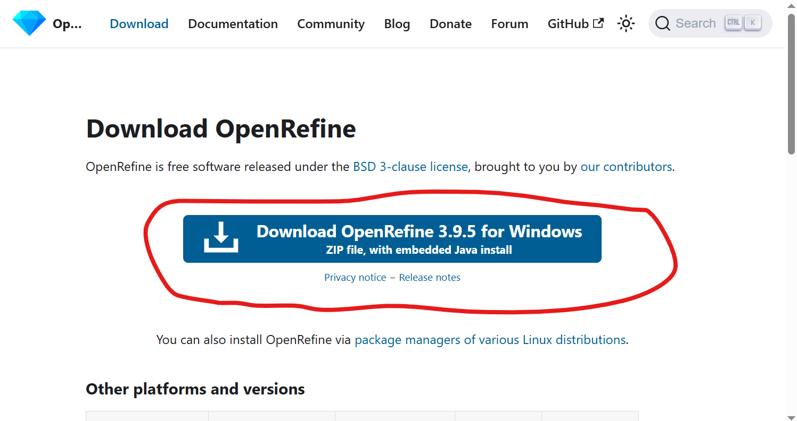
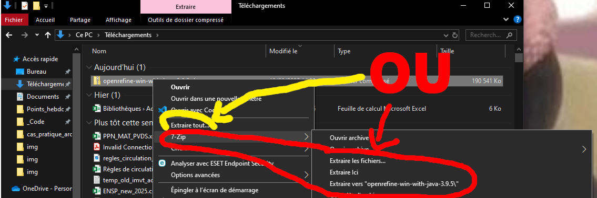
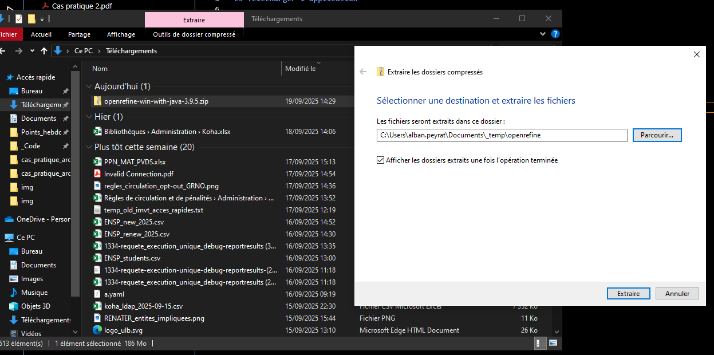
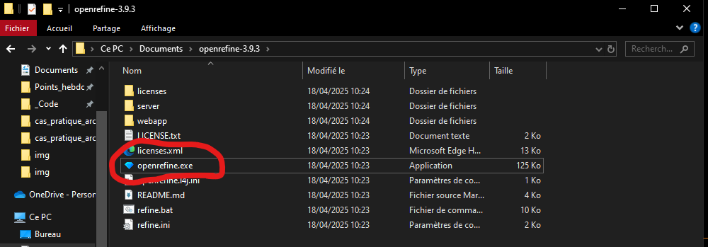
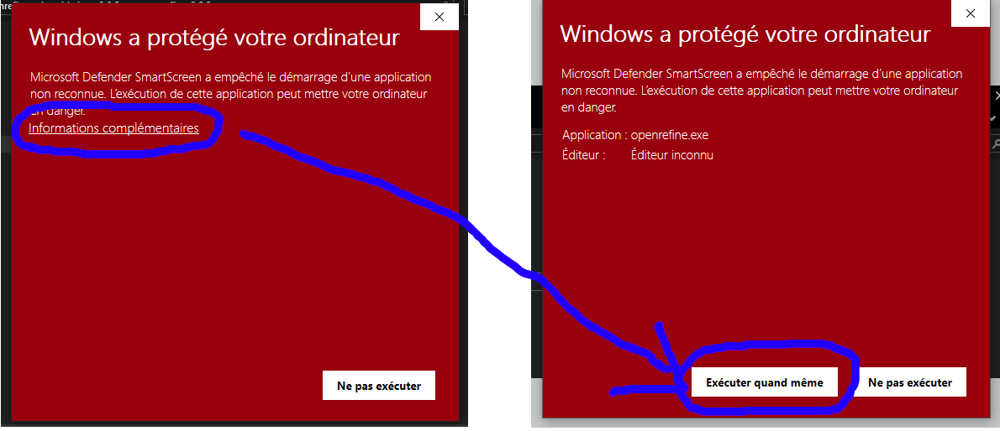
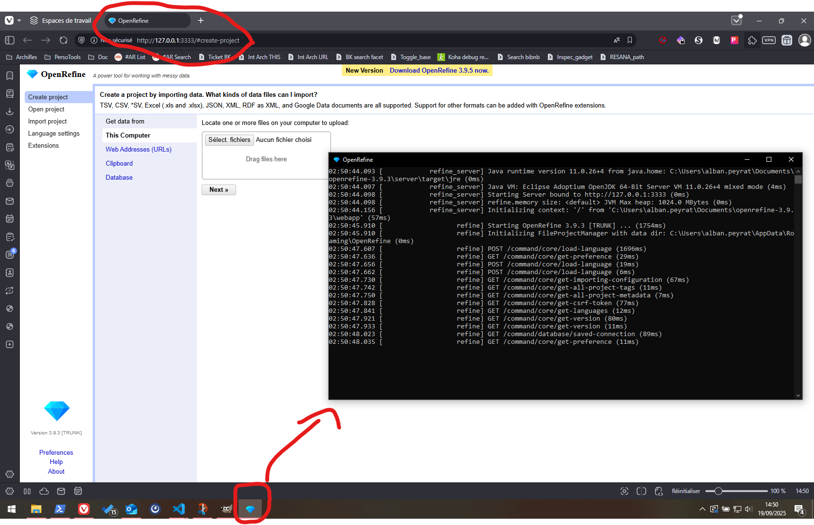

# Télécharger & installer OpenRefine

Cette procédure est simplifiée.

## Télécharger l'application

* Ouvrez : https://openrefine.org/download
* Cliquez sur le gros bouton bleu

## Installer l'application

* Vous venez de télécharger un fichier `.zip`
* Extrayez le contenu dans un dossier

## Lancer OpenRefine

* Dans le dossier que vous avez extrait, exécuter le fichier `openrefine.exe`

* Potentiellement, Windows "protégera votre ordinateur" lors de votre première exécution
* Ouvrez les _Informations complémentaires_
* Puis _Exécutez quand même_ l'application

L'exécution de l'application a 2 conséquences :

* L'ouverture d'une application ressemblant à l'invite de commande
  * **Ne la fermez surtout pas tant que vous travaillez avec Open Refine**
* L'ouverture d'un nouvel onglet dans votre navigateur avec l'URL `http://127.0.0.1:3333`

## Travailler avec OpenRefine

À partir de maintenant, vous pouvez travailler dans OpenRefine **dans votre navigateur internet**, à l'URL `http://127.0.0.1:3333`, **tant que vous gardez l'application à l'icône de diamant ouverte**.